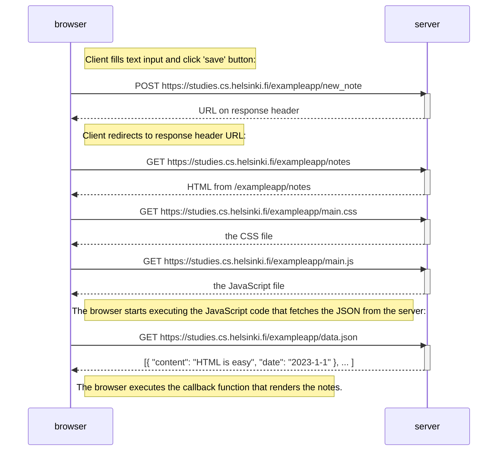

#4.exercise

```mermaid
  sequenceDiagram
      participant browser
      participant server

      Note right of browser: Client fills text input and click 'save' button:

      browser->>server: POST https://studies.cs.helsinki.fi/exampleapp/new_note
      activate server
      server-->>browser: URL on response header
      deactivate server

      Note right of browser: Client redirects to response header URL:

      browser->>server: GET https://studies.cs.helsinki.fi/exampleapp/notes
      activate server
      server-->>browser: HTML from /exampleapp/notes
      deactivate server

      browser->>server: GET https://studies.cs.helsinki.fi/exampleapp/main.css
      activate server
      server-->>browser: the CSS file
      deactivate server

      browser->>server: GET https://studies.cs.helsinki.fi/exampleapp/main.js
      activate server
      server-->>browser: the JavaScript file
      deactivate server

      Note right of browser: The browser starts executing the JavaScript code that fetches the JSON from the server:

      browser->>server: GET https://studies.cs.helsinki.fi/exampleapp/data.json
      activate server
      server-->>browser: [{ "content": "HTML is easy", "date": "2023-1-1" }, ... ]
      deactivate server

      Note right of browser: The browser executes the callback function that renders the notes.
```
