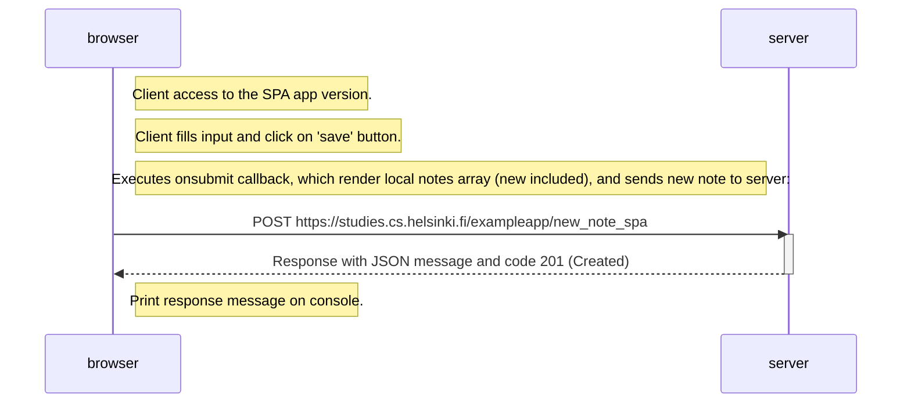

#6.exercise

```mermaid
  sequenceDiagram
      participant browser;
      participant server;

      Note right of browser: Client access to the SPA app version.
      Note right of browser: Client fills input and click on 'save' button.
      Note right of browser: Executes onsubmit callback, which render local notes array (new included), and sends new note to server:
      
      browser->>server: POST https://studies.cs.helsinki.fi/exampleapp/new_note_spa
      activate server
      server-->>browser: Response with JSON message and code 201 (Created)
      deactivate server

      Note right of browser: Print response message on console.

```